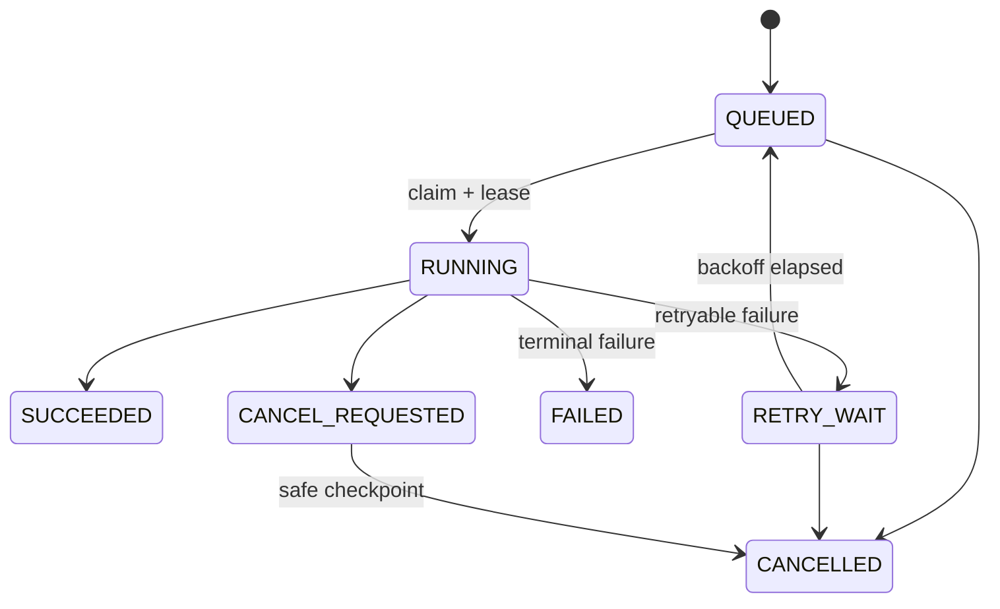

# Job System V0

## Decision

`Job` is the durable record of asynchronous intent. PostgreSQL is the business source of truth; a queue adapter only delivers eligible work. V0 uses a fixed process: `Director -> Video -> Publish -> Review`.

## Records and ownership

| Record | Purpose | Owner |
|---|---|---|
| `jobs` | desired work, arguments, state, idempotency key, scheduling | Job |
| `job_attempts` | lease, worker, timing, error category and output summary | Job |
| `job_events` | append-only transition/audit stream | Job |
| `job_dependencies` | prerequisite graph for the fixed process | Job |
| `job_dead_letters` | terminal work retained for operator action | Job |

A job carries `id`, `type`, `project_id?`, `payload_ref`, `priority`, `scheduled_at`, `idempotency_key`, `state`, `attempt_count`, `max_attempts`, `created_by`, and `correlation_id`. Large payloads and media stay in Project/Asset records; the job holds stable IDs and revision IDs only.

## Contract

| Actor | Must do | Must not do |
|---|---|---|
| Core use case | validate, persist the business intent and job atomically, publish after commit | perform FFmpeg, browser automation, or infinite polling |
| Queue adapter | wake eligible consumers and support retry delay | become the only record of job state |
| Worker | claim a lease, heartbeat, emit events, report a classified result | directly alter unrelated module tables |
| Operator/API | inspect, cancel, retry-from-policy, resolve dead letters | mutate state with ad-hoc SQL |

The queue port is conceptually `enqueue`, `claim`, `heartbeat`, `succeed`, `fail`, `cancel`, and `recoverExpiredLeases`. The concrete V0 candidate is pg-boss, subject to the initialization spike. The implementation must include a database-backed lease reconciler that transitions expired `RUNNING`/`CANCEL_REQUESTED` records through the recovery path and re-delivers eligible work. pg-boss supervisor maintenance is supporting delivery behavior, not the only recovery authority.

## Reliability rules

1. Job creation and the associated domain transition use one database transaction/outbox boundary.
2. Every externally visible action uses a deterministic idempotency key: `project + revision + action + destination/provider`.
3. A worker may execute at least once; handlers must make side effects idempotent.
4. A lease has an expiry and heartbeat. Expired RUNNING work is recovered through a documented reconciliation path.
5. Retry only transient, throttling, or explicitly recoverable errors; validation, policy, unsupported capability and corrupted input are terminal.
6. Cancellation is cooperative. A worker checks at safe checkpoints and reports `CANCELLED`, never assumes a killed process completed no side effects.
7. A failed dependency blocks downstream creation; it never silently triggers a Publish or Review job.
8. Schedules store UTC timestamps and the user-selected timezone separately.

## Required job types

| Type | Producer | Consumer | Output reference |
|---|---|---|---|
| `director.generate` | Director | Core AI handler/worker | script or storyboard revision |
| `video.render` | Video | Video Worker | Render and derived Assets |
| `publisher.publish` | Publisher | Publisher Worker | PublishAttempt / external post ID |
| `review.collect_metrics` | Review | Publisher/Review worker handler | MetricSnapshot |
| `asset.cleanup` | Asset | maintenance worker | retention event |

## Operator experience

The API returns `202 Accepted` with `jobId` for asynchronous commands. Query endpoints expose the current state, last attempt, next retry time and safe redacted error summary. Re-run creates a new attempt or a new job according to the idempotency policy; it never overwrites historical attempts.
