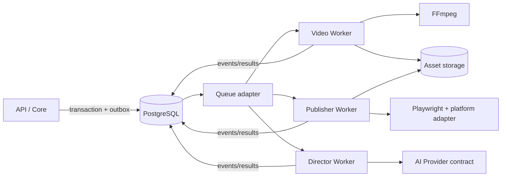

# Worker Architecture V0

## Process boundary

Core is the control plane. Workers are independently started processes which claim durable Jobs and return bounded result contracts.

## Worker responsibilities

| Process | Handles | Capabilities | Does not own |
|---|---|---|---|
| Video Worker | `video.render`, media maintenance | FFmpeg, probes, storage staging/promote | creative planning, publishing accounts |
| Publisher Worker | `publisher.publish`, authorized metrics collection | Playwright, platform adapters, credential resolution | rendering, source assets |
| Director Worker | `DIRECTOR_GENERATE_SCRIPT`, `DIRECTOR_GENERATE_STORYBOARD` | AI Provider contract, Director application ports | Video/Publisher/Review execution and private tables |
| Maintenance handler | retention/reconciliation jobs | database and storage maintenance | content decisions |

Workers use only module application ports and contracts. They do not import HTTP controllers or the web UI, and do not update another module's tables except through its application command port.

## Execution protocol

1. Claim one eligible job and create an immutable attempt with a time-bounded lease.
2. Load only IDs/revisions named by the payload and revalidate their state.
3. Emit a `started` event, then heartbeat during long-running operations.
4. Stage any artifact outside canonical storage; validate its checksum and media metadata.
5. Promote output through Asset, persist the module result, and complete the job in the same success boundary.
6. On error, store a redacted category and retry recommendation; Job applies policy.

## V0 deployment profile

The development/first deployment profile is one Windows or Linux host running PostgreSQL, the API process, Director Worker, Video Worker and Publisher Worker as separately supervised processes, plus a local filesystem storage adapter rooted outside temporary directories. Process separation is mandatory even when they share a host. Containers, Kubernetes and horizontal scaling are deferred.

Publisher real-adapter composition is opt-in with safe defaults: `PUBLISHER_REAL_ADAPTERS_ENABLED=false`, `PUBLISHER_WECHAT_ALLOW_SUBMIT=false`, `PUBLISHER_WECHAT_HEADED=true`, `PUBLISHER_PROFILE_ROOT=./storage/publisher-profiles` and `PUBLISHER_EVIDENCE_ROOT=./artifacts/publisher`. Credential resolution and browser profile state stay inside the Publisher Worker and are excluded from Job payloads and ordinary logs.

Each worker receives its own least-privilege configuration and writable staging directory. Publisher browser profiles are isolated per account/environment. The Publisher Worker must not share its browser state with an interactive user session.

## Health, recovery and limits

- Readiness requires database, queue and required storage access; publisher readiness additionally verifies the browser binary, not platform login.
- Liveness means event loop responsive; meaningful progress is reported by a job heartbeat, not merely process uptime.
- Video jobs have explicit CPU, disk staging, duration and output-size limits. Publisher jobs have action timeout, navigation timeout, rate-limit backoff and screenshot/log evidence limits.
- Startup recovery reconciles expired leases and incomplete staging records before accepting new work.
- Lease reconciliation is a continuously observable database-backed worker capability; queue supervisor settings cannot replace it. Recovery emits a stable Job event/metric and is covered by the worker crash acceptance test.
- Graceful shutdown stops claims, extends/finishes only safe work, and lets leases expire for remaining work.

## Future scaling

Workers scale by job-type concurrency and host resource class, not by letting Core execute work. A rendering host and a publisher host may later use separate storage/network permissions without changing domain contracts.
